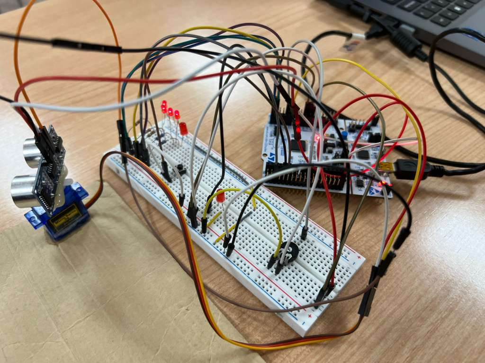

# STM32 Ultrasonic Scanning System

This was a microprocessor/embedded systems project I worked on using an STM32 microcontroller. The main goal was to build a distance scanning system that could measure objects with an ultrasonic sensor while moving a servo to different angles.

## What the project does

The system has two main modes:

- **Manual mode:** the servo angle is controlled with an analog input, and the system can take a distance measurement at that position.
- **Automatic mode:** the servo moves through five preset angles (-90°, -45°, 0°, 45°, and 90°) and measures the distance at each position.

The distance is measured using the ultrasonic sensor's echo pulse. A hardware timer captures the rising and falling edges of the echo, and the pulse width is converted into distance in centimeters.

## Project Setup

Below is the hardware setup used for the project, including the STM32 board, ultrasonic sensor, servo motor, breadboard, and LED indicators.



## Main features

- Ultrasonic distance measurement using timer input capture
- Manual and automatic scanning modes
- Servo control using PWM
- ADC input for manual servo positioning
- UART output for measurements and status messages
- GPIO/button interrupts
- Five-LED distance indicator
- Automatic scanning across multiple angles

## How it works

The STM32 sends a short trigger pulse to the ultrasonic sensor. When the echo signal comes back, the timer records the rising and falling edges. The difference between those two timer values gives the pulse width, which is then converted into distance.

For the servo, PWM is used to control the angle. In automatic mode, the servo moves through the five preset positions and stores the distance measured at each one.

The LED display gives a quick visual indication of how close an object is. More LEDs turn on as the object gets closer.

## Technologies used

- C
- STM32
- Embedded systems
- GPIO
- ADC
- UART
- Timers / input capture
- Interrupts
- PWM

## Source code

The main application code is located in:

```text
src/main.c
```

This repository contains the main source code from the project. I do not have the complete original STM32CubeIDE project folder anymore, so files such as the original `.ioc`, generated headers, and full build configuration are not included.

## What I learned

This project helped me understand how different microcontroller peripherals work together in one system. I got more experience with timers, interrupts, PWM, ADC, UART, and working directly with STM32 registers. It also helped me understand how timing matters in embedded systems, especially when measuring the ultrasonic echo pulse and controlling multiple parts of the system at the same time.
